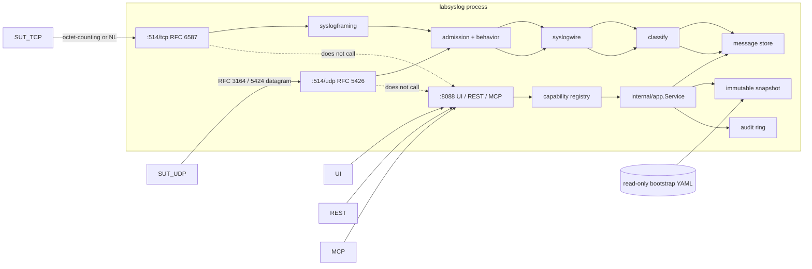

# 01 — Architecture

Last reviewed: 2026-09-04

LabSyslog is a single-process Go appliance. One binary (`labsyslog`),
one container. YAML is desired state. The message store is ephemeral.
UDP and TCP syslog are the data plane. HTTP is the control plane.

## Process



Invalid bootstrap: process exits before binding listeners. Same rule as
LabDNS / LabMail / LabNTP.

Lifecycle:

1. Load YAML → normalize → validate → compile snapshot → compute revision.
2. Bind UDP if `spec.listeners.udp.enabled` (default true).
3. Bind TCP if `spec.listeners.tcp.enabled` (default true).
4. Bind management if `--management-listen` / `spec.listeners.management.address` is set.
5. Write PID file if requested.
6. On `SIGTERM`/`SIGINT`: stop accept, drain TCP sessions up to
   `--shutdown-timeout` (default 5s), stop HTTP, wipe store, exit 0.

UDP and TCP keep running if management is off or wedged.

## Layers

| Layer | Package | Responsibility |
|---|---|---|
| Wire codec | `internal/syslogwire` | PRI, 3164, 5424. No library types. |
| TCP framing | `internal/syslogframing` | RFC 6587 octet-counting and non-transparent. |
| Listeners | `internal/syslogserver` | UDP/TCP accept, admission, size caps. |
| Store | `internal/store` | Bounded ring, indexes, waiters, generation. |
| Snapshot | `internal/snapshot` | Immutable compiled spec, atomic swap. |
| App | `internal/app` | Plan/apply/reset/wait/list. Only place adapters call. |
| REST | `internal/control/rest` | `/v1` adapter. Must not import `internal/web`. |
| MCP | `internal/control/mcp` | `POST /mcp` adapter. |
| Auth | `internal/auth` | Bearer + cookie CSRF. |
| UI | `internal/web` | `go:embed` SPA. Wired from `cmd/labsyslog`, not from rest. |

## Control vs data plane

- Data plane: `syslogwire` + `syslogframing` + `syslogserver` + `store`.
- Control plane: `control/rest` + `control/mcp` + `web` + `auth`.
- Invariant: production data-plane packages do not import control, web,
  or `net/http`.
- `--management-listen` may be omitted. Serve-without-management is a
  first-class mode and is how M1 is accepted.

## Ingest pipeline

`internal/syslogserver` owns ingest. Binding order (do not reorder):

1. **Size/framing** — UDP oversize or empty datagram: drop, metric, store
   nothing. TCP RFC 6587 split (`auto` \| `octet-counting` \|
   `non-transparent`): octet-counting MSG-LEN > `maxMessageBytes` closes
   the session with no partial store; non-transparent oversize drops the
   frame and the session continues. LF and NUL trailers (optional CR
   before LF) are stripped and are not part of `raw`.
2. **Admission** — first policy gate after size/framing. Source IP must
   match `allowClientCidrs` (IPv4-mapped IPv6 unmapped first). Rate caps
   `maxDatagramsPerSec` / `maxDatagramsPerIP`. Miss is silent ignore
   (UDP) or connection close (TCP); nothing is stored.
3. **`behavior.mode`** — from `spec.syslog.behavior.mode`. `drop-silent`
   / `close` discard after admission and before parse. UDP `close` is
   drop-silent.
4. **Parse** — `syslogwire` inside the pipeline. UDP/TCP call sites must
   not parse before this hook. `unknown_facility` is a warning, not a drop.
5. **Classify** — first enabled `spec.filters[]` match wins (list order,
   not longest-prefix). Actions `capture` | `drop-silent` | `tag`.
   Unmatched = **capture** (ADR 0009). No required catch-all.
6. **`Handler.Insert(model.Message)`** — already parsed and classified.
   `cmd/labsyslog serve` installs `store.Store` (thin adapter) as the
   Handler. STA-001 replaces the spec-direct load, not this Handler.

IPv4-mapped IPv6 addresses are unmapped before admission. `Message.truncated`
is always false in 1.0; oversize is not stored.

## Desired state

One document:

```yaml
apiVersion: labsyslog.dev/v1alpha1
kind: LabSyslog
metadata:
  name: lab-sink
spec:
  listeners:
    udp:
      enabled: true
      address: ":514"
    tcp:
      enabled: true
      address: ":514"
      framing: auto
    tls:
      enabled: false
      address: ":6514"
      certFile: ""
      keyFile: ""
      caFile: ""
      clientAuth: false
    management:
      address: ":8088"
      restPath: /v1
      mcpPath: /mcp
  auth:
    mode: bearer
    tokens:
      - id: admin
        role: administrator
        secretFile: /run/secrets/labsyslog-token
  ui:
    enabled: true
  management:
    allowedOrigins: []
    mcp:
      allowLegacyClients: true
    bodyLimit: 1MiB
    requestsPerSecond: 32
    burst: 64
    maxConcurrent: 256
  syslog:
    parse:
      rfc3164: true
      rfc5424: true
      bestEffort: true
    maxMessageBytes: 64KiB
    udpMaxDatagramBytes: 64KiB
    tcpIdleTimeout: 2m
    hostname: labsyslog.lab
    behavior:
      mode: accept
  admission:
    allowClientCidrs:
      - "10.99.42.0/24"
      - "127.0.0.0/8"
      - "::1/128"
    maxDatagramsPerSec: 20000
    maxDatagramsPerIP: 2000
    maxTcpConns: 256
    maxTcpConnsPerIP: 16
    sessionTimeout: 2m
  store:
    maxMessages: 10000
    maxBytes: 256MiB
    fullPolicy: evict_oldest
    maxWait: 60s
    rawRetain: true
  filters: []
  observability:
    logLevel: info
    metrics:
      publicPath: false
```

Field semantics: [04-state-and-configuration.md](04-state-and-configuration.md).
`listeners.tls.enabled: true` is a 1.0 validate error (ADR 0012).

## Message model

```
Message
  id            ULID
  receivedAt    time.Time (process clock, UTC stored as RFC3339Nano)
  transport     udp | tcp
  remoteIP      netip.Addr
  remotePort    uint16
  raw           []byte          # omitted from list views when rawRetain and not requested
  truncated     bool            # always false in 1.0; oversize is dropped, not stored
  parseWarning  string          # empty if clean
  tags          []string        # appliance classification from filter action tag; not syslog content
  parsed        Parsed
    pri         uint8           # 0–191
    facility    uint8           # 0–23
    severity    uint8           # 0–7
    version     uint8           # 0 for 3164, 1 for 5424
    timestamp   time.Time       # zero if absent/unparseable
    hostname    string
    appName     string
    procID      string
    msgID       string
    structured  []SDElement     # 5424 only
    message     string
```

`PRI = facility*8 + severity`. Facilities 0–23 and severities 0–7 follow
RFC 5427 keywords (`kern`…`local7`, `emerg`…`debug`).

Best-effort: an unparseable datagram that passes admission is stored
with `parseWarning` set and `parsed` zero-valued except whatever prefix
could be recovered. This matches LabMail malformed-MIME behavior.

## Admission vs filters

Two stages, in order:

1. **Admission** (`spec.admission`). Source IP must match
   `allowClientCidrs`. Rate and connection caps apply. Failure is
   silent ignore (UDP) or connection close (TCP). Nothing is stored.
2. **Filters** (`spec.filters`). First enabled filter whose match
   hits wins (list order, not longest-prefix). Actions: `capture`
   (default), `drop-silent`, `tag`. `tag` appends `action.tag` to
   `Message.Tags`. No matching filter = **capture**. See ADR 0009.

This is the opposite of LabNTP unmatched-drop. A sink's job is capture.
Operators who want deny-by-default add an explicit last filter with
`action: drop-silent` and a catch-all CIDR.

## Residual limitations (1.0)

- No RFC 5425 TLS.
- No RELP, BEEP, journald native, RFC 5848 signatures.
- No forwarding.
- No persistent store.
- No probabilistic drop engine. `spec.syslog.behavior.mode` is
  deterministic: `accept` | `drop-silent` | `close` (TCP only).
- No per-message rewrite of the raw bytes. UDP/TCP oversize is dropped
  and nothing is stored; `Message.truncated` is always false in 1.0.
- IPv4-mapped IPv6 addresses are normalized to IPv4 before CIDR match.

## Hardening

- UID/GID `65532:65532`
- Scratch/static image
- Read-only root filesystem
- `cap_drop: ALL`
- `no-new-privileges`
- `/tmp` on tmpfs
- Integrator compose may add `NET_BIND_SERVICE` when publishing host 514
- This repo's `make test-container` binds `:1514` and does not need the cap
